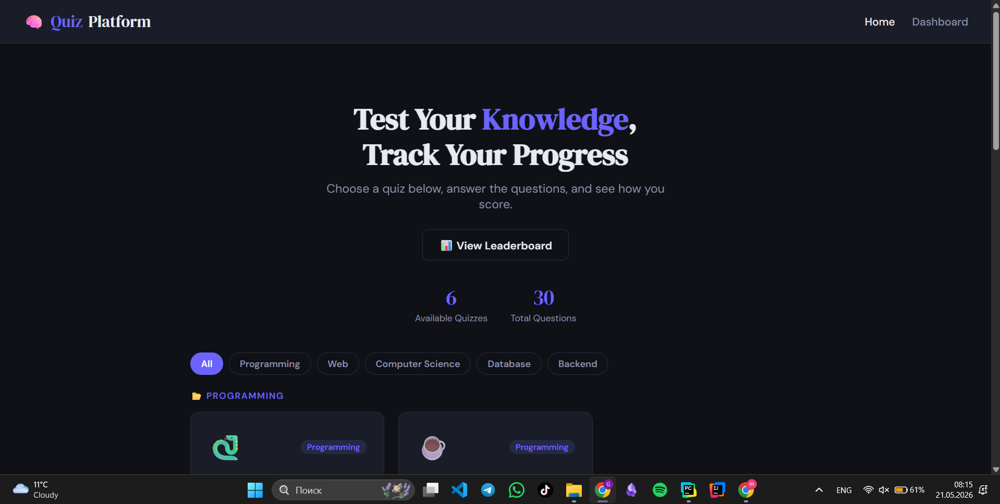
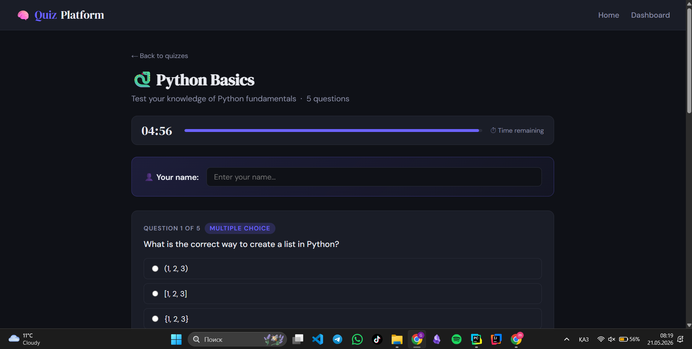
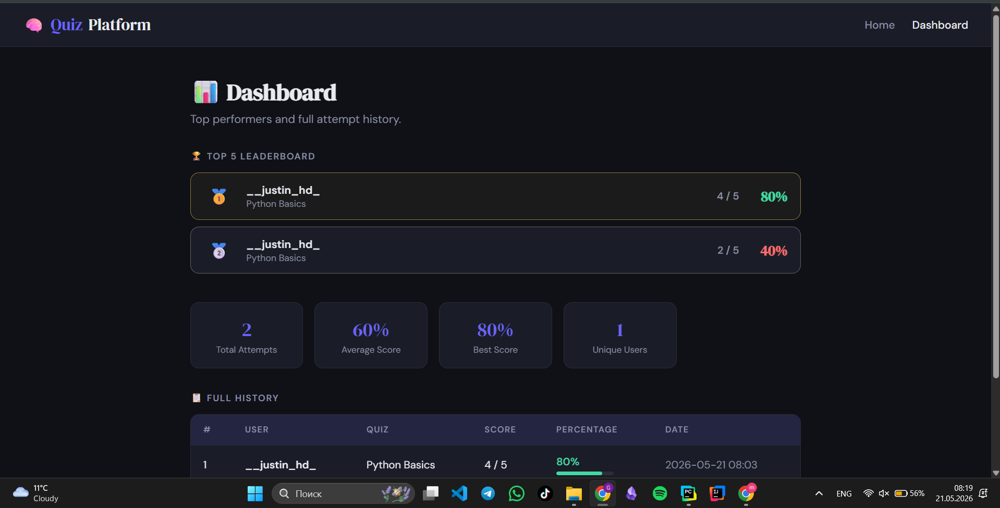
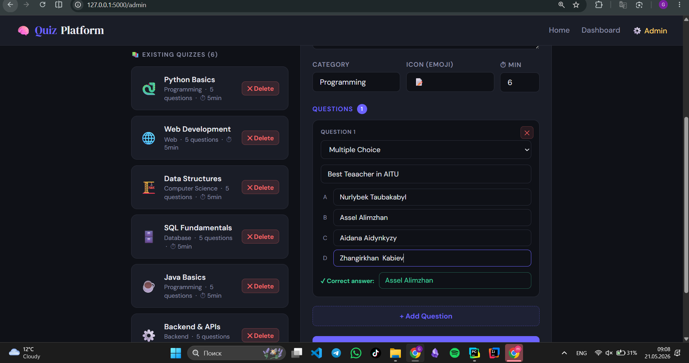

#  Quiz & Test Prep Platform

A web-based quiz application built with Flask and Python OOP for the Introduction to Programming 2 final project at Astana IT University.

---

##  Project Description

Quiz & Test Prep Platform is a multi-page web application that allows users to take topic-based quizzes, receive instant feedback on their answers, and track their performance history over time. The platform supports two question types - Multiple Choice and True/False - and stores all data in local files (no database required).

---

##  Features

-  **Multiple quizzes** on different topics (Python Basics, Web Development, Data Structures)
-  **Two question types**: Multiple Choice and True/False
-  **Instant results** with a per-question answer review
-  **Dashboard** — full history of all attempts loaded from CSV
-  **File-based persistence** - questions in JSON, results in CSV
-  **Robust error handling** - app never crashes on missing/corrupt files
-  **Clean OOP architecture** - abstract base class + polymorphism

---

##  Technologies Used

| Technology | Purpose |
|---|---|
| Python 3.10+ | Core language |
| Flask 2.3+ | Web framework / routing |
| Jinja2 | HTML templating with inheritance |
| JSON | Storing quiz questions |
| CSV | Storing attempt history |
| unittest | Unit testing |
| HTML / CSS | Frontend (custom dark theme, no Bootstrap) |

---

##  Project Structure

```
quiz_platform/
├── app.py                  # Backend: OOP classes + Flask routes
├── requirements.txt        # Python dependencies
├── README.md               # This file
│
├── data/
│   ├── questions.json      # All quizzes and questions
│   └── results.csv         # History of all attempts (auto-created)
│
├── templates/
│   ├── base.html           # Base template (Jinja2 blocks)
│   ├── index.html          # / - Home page, quiz catalogue
│   ├── quiz.html           # /quiz/<id> - Question form
│   ├── result.html         # /result - Score + answer review
│   ├── dashboard.html      # /dashboard - Attempt history
│   └── 404.html            # Error page
│
└── tests/
    └── test_quiz.py        # 20 unit tests (unittest)
```

---

## Installation

### 1. Clone the repository

```bash
git clone https://github.com/<your-username>/quiz-platform.git
cd quiz-platform
```

### 2. Create and activate a virtual environment

```bash
# Windows
python -m venv venv
venv\Scripts\activate

# macOS / Linux
python -m venv venv
source venv/bin/activate
```

### 3. Install dependencies

```bash
pip install -r requirements.txt
```

---

##  How to Run

```bash
python app.py
```

Then open your browser and go to: **http://127.0.0.1:5000**

---

##  Running Tests

```bash
python tests/test_quiz.py -v
```

Expected output: **20 tests, 0 failures.**

---

##  Application Routes

| Route | Method | Description                                              |
|---|---|----------------------------------------------------------|
| `/` | GET | Home page - list of all available quizzes                |
| `/quiz/<quiz_id>` | GET / POST | Quiz page - renders questions form; POST submits answers |
| `/result` | GET | Result page - displays score and answer review           |
| `/dashboard` | GET | Dashboard - full attempt history from CSV                |

---

## OOP Architecture

```
Question (ABC - Abstract Base Class)
├── MultipleChoiceQuestion
│   └── check_answer() - case-insensitive exact match
└── TrueFalseQuestion
    └── check_answer() - normalises True/False/yes/no/1/0

QuizManager
├── load_all_quizzes()   - reads questions.json
├── get_quiz_by_id()     - finds one quiz by ID
├── build_questions()    - factory: creates Question objects
└── calculate_score()    - calls check_answer() polymorphically
```

---

##  Screenshots






---

##  Team Members

| Name               | Role |
|--------------------|---|
| *Shugay Nurtileu * | Full-stack development, OOP design, testing |

---

## License

This project was created for educational purposes at **Astana IT University**, Department of Software Engineering, ITP2 Final Project - 2024.